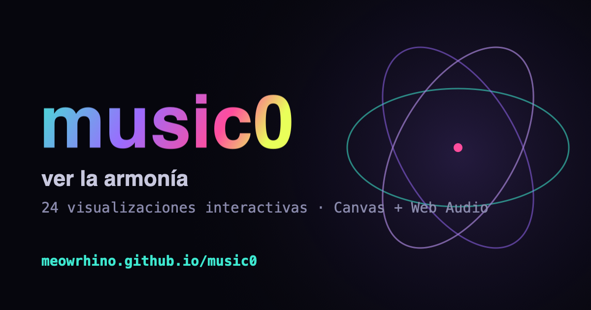

# music0 · visualizaciones de la armonía musical

[](https://meowrhino.github.io/music0/)


### 🌐 **[Pruébalo en vivo → meowrhino.github.io/music0](https://meowrhino.github.io/music0/)**

[](https://meowrhino.github.io/music0/)

**24 juguetes interactivos** para **ver y oír** la teoría musical, a partir de la
[investigación](investigacion.md) de partida. Todo es **HTML + Canvas + Web Audio API** puro:
sin build, sin dependencias, sin red. Cada pieza es un `.html` autónomo que funciona abriéndolo
directamente. Hay además un **[ensayo explorable](ensayo.html)** y una página **[sobre](sobre.html)**.

👉 Empieza por **[`index.html`](index.html)** (la galería) o por el **[ensayo](ensayo.html)**.

## Cómo abrir

```bash
# opción A: doble clic en index.html (file://) — funciona

# opción B (recomendada): servidor estático local
cd music0
python3 -m http.server 8000
# luego abre http://localhost:8000
```

> El audio arranca al primer clic/gesto (política de autoplay de los navegadores).

## Las pruebas (24 piezas, agrupadas por categoría)

Puntuaciones de la investigación — **VI** = interés visual, **CD** = profundidad conceptual (1–10).
En la portada (`index.html`) están ordenadas de lo geométrico a lo perceptual.

**★ Instrumento en vivo**

| # | Prueba | Qué hace | Cat. | VI/CD |
|---|--------|----------|------|-------|
| 13 | [Instrumento en vivo](pruebas/13-instrumento.html) | Tocas (piano / teclado / Web MIDI) y el círculo, el Tonnetz y las ondas reaccionan a la vez. | D | 9/7 |

**I · Geometría de acordes y tríadas**

| # | Prueba | Qué hace | Cat. | VI/CD |
|---|--------|----------|------|-------|
| 02 | [Círculo cromático](pruebas/02-circulo-cromatico.html) | Acordes como polígonos; presets, raíz y orden cromático↔quintas. | 1 | 8/6 |
| 03 | [Tonnetz](pruebas/03-tonnetz.html) | Retícula de tríadas; ▲ mayor / ▼ menor; hover + clic para sonar. | 4 | 9/9 |
| 11 | [Tonnetz+](pruebas/11-tonnetz-midi.html) | Transformaciones PLR + Web MIDI + estela de conducción de voces (atajos P/L/R). | 4 | 9/9 |
| 12 | [Tonnetz toroidal](pruebas/12-tonnetz-toro.html) | La retícula envuelta en un toro 3D navegable (Z₁₂ ≅ Z₃×Z₄). Gira + PLR. | 4 | 9/10 |
| 14 | [Orbifold de Tymoczko](pruebas/14-orbifold-tymoczko.html) | Una díada = un punto en una banda de Möbius; borde=unísonos, centro=tritonos. Cruza voces. | 4 | 8/10 |
| 15 | [Orbifold de tríadas](pruebas/15-orbifold-triadas.html) | El triángulo de tipos de tríada (sección del prisma): aumentada al centro, unísonos en los vértices. | 4 | 8/10 |
| 21 | [Collares de escalas](pruebas/21-collares-escalas.html) | Escalas como collares de 12 cuentas (Ian Ring); modos = rotaciones, patrón de intervalos + ID binario. | 1 | 7/9 |
| 22 | [Orbifold de tétradas](pruebas/22-orbifold-tetradas.html) | El espacio de acordes de 4 notas: tetraedro 3D, séptima disminuida en el centro. | 4 | 8/10 |

**II · Frecuencia, ratios y afinación**

| # | Prueba | Qué hace | Cat. | VI/CD |
|---|--------|----------|------|-------|
| 01 | [Lissajous](pruebas/01-lissajous.html) | Intervalos como curvas. Justo = curva fija; temperado = gira (∝ batido). | 2 | 9/8 |
| 04 | [Serie armónica](pruebas/04-serie-armonica.html) | Cuerda vibrante, 16 sobretonos, cents y timbre aditivo. | 2 | 8/9 |
| 10 | [Lattice de entonación justa](pruebas/10-lattice-ji.html) | Retícula 5-límite (quintas × terceras justas); ratios, cents; justa vs temperada. | 2 | 8/9 |
| 09 | [Hélice de Shepard](pruebas/09-helice-shepard.html) | Tono que sube/baja para siempre (Shepard–Risset), en espiral. | 2 | 7/9 |
| 16 | [Cuerdas pitagóricas](pruebas/16-cuerdas-baroque.html) | Cuerdas con longitud ∝ 1/frecuencia; se pulsan en secuencia y vibran. À la Baroque.me. | 8 | 9/8 |
| 23 | [Hélice de croma](pruebas/23-helice-croma.html) | La hélice de la altura de Shepard; doble hélice de las dos escalas de tonos enteros. | 1 | 9/8 |
| 24 | [Armonógrafo](pruebas/24-armonografo.html) | Péndulos amortiguados que dibujan el cociente: figuras que decaen en espiral. | 2 | 9/7 |

**III · Física y espectro**

| # | Prueba | Qué hace | Cat. | VI/CD |
|---|--------|----------|------|-------|
| 05 | [Cymatics / Chladni](pruebas/05-cymatics-chladni.html) | 12 000 granos posándose en las líneas nodales del modo (n, m). | 3 | 9/8 |
| 08 | [Mandala FFT](pruebas/08-mandala-fft.html) | El espectro dibuja un mandala radial que late; con micrófono opcional. | 5 | 9/5 |
| 18 | [Cromagrama](pruebas/18-cromagrama.html) | El espectro plegado en 12 clases de altura; círculo de croma + cromagrama desplazante. Con micro. | 5 | 8/8 |
| 19 | [Espectrograma](pruebas/19-espectrograma.html) | El espectro en cascada: tiempo en X, frecuencia (log) en Y, brillo = energía. Con micro. | 5 | 8/6 |

**IV · Psicoacústica y color**

| # | Prueba | Qué hace | Cat. | VI/CD |
|---|--------|----------|------|-------|
| 06 | [Curva de disonancia](pruebas/06-curva-disonancia.html) | Modelo Plomp–Levelt/Sethares; valles = consonancia. Arrastra y oye. | 6 | 8/10 |
| 07 | [Color ↔ nota](pruebas/07-color-scriabin.html) | Círculo de quintas con los colores de Scriabin / el arcoíris sinestésico. | 7 | 8/7 |
| 17 | [Heatmap de disonancia](pruebas/17-heatmap-disonancia.html) | Mapa 2D de disonancia sensorial de tríadas (Sethares); los valles = consonancia. | 6 | 8/9 |
| 20 | [Batido de dos tonos](pruebas/20-batido.html) | Dos tonos cercanos y su envolvente pulsando: del unísono a la aspereza (banda crítica). | 6 | 8/8 |

## Capa de color compartida

El círculo cromático (02), el Tonnetz (03), el Tonnetz+ (11) y el toro (12) comparten un **selector de
paleta** (arriba a la derecha: croma / **Scriabin** / 5tas). La elección se guarda en `localStorage`,
así que cambiarla en una pieza **tiñe todas las demás** — una capa de color común sin romper la
autonomía de cada `.html`. El mapa de Scriabin es el mismo de la pieza 07.

## Rumbos posibles (la "web loquita")

- **A · Galería + navegador** ✦ *(aquí vivimos)* — mini-experimentos autónomos + este `index.html`.
- **B · Showpiece profundo** ◐ *(en marcha)* — **Tonnetz+** (PLR + Web MIDI), **Tonnetz toroidal 3D**
  y el **orbifold de Tymoczko** (banda de Möbius de díadas) ya son piezas profundas.
- **C · Ensayo explorable** ✦ *(hecho)* — [`ensayo.html`](ensayo.html): scrollytelling de 10 paradas
  que hila las piezas con narrativa y widgets incrustados (modelo osar.fr).
- **D · Playground audiovisual en vivo** ✦ *(hecho)* — el **Instrumento (13)**: tocas
  (piano/teclado/MIDI) y el círculo + Tonnetz + ondas reaccionan a la vez.
- **E · Hub mixto** ◐ *(en marcha)* — el hub ya integra galería + ensayo destacado + pieza estrella
  (★ instrumento); falta fundirlo aún más en una sola experiencia.

## Ideas para el siguiente lote

- **Modo E** a tope: una portada-experiencia que funda hero en vivo + ensayo + galería en un solo scroll.
- Más profundidad: orbifold de tétradas (4 notas), Chladni 3D (marching cubes), hélice de croma doble.
- Detalles "baja" pendientes de las revisiones (etiquetas, guards) y unificar la capa de color en todas.

## Estructura

```
music0/
├── index.html              ← navegador / galería (el hub)
├── ensayo.html             ← ensayo explorable (scrollytelling)
├── sobre.html              ← sobre el proyecto + créditos
├── investigacion.md         ← investigación de partida
├── README.md
└── pruebas/
    ├── 01-lissajous.html
    ├── 02-circulo-cromatico.html
    ├── 03-tonnetz.html
    ├── 04-serie-armonica.html
    ├── 05-cymatics-chladni.html
    ├── 06-curva-disonancia.html
    ├── 07-color-scriabin.html
    ├── 08-mandala-fft.html
    ├── 09-helice-shepard.html
    ├── 10-lattice-ji.html
    ├── 11-tonnetz-midi.html
    ├── 12-tonnetz-toro.html
    ├── 13-instrumento.html
    ├── 14-orbifold-tymoczko.html
    ├── 15-orbifold-triadas.html
    ├── 16-cuerdas-baroque.html
    ├── 17-heatmap-disonancia.html
    ├── 18-cromagrama.html
    ├── 19-espectrograma.html
    ├── 20-batido.html
    ├── 21-collares-escalas.html
    ├── 22-orbifold-tetradas.html
    ├── 23-helice-croma.html
    └── 24-armonografo.html
```

## Stack

Vanilla JS · Canvas 2D · Web Audio API (`OscillatorNode`, `PeriodicWave`, `AnalyserNode`, `GainNode`)
· Web MIDI · getUserMedia. Sin frameworks ni CDNs para que sea portable y fácil de hackear.
